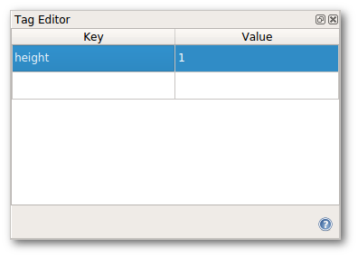

## About object tags

In general, map objects are characterized by location and symbol.
Object tags store additional information in the form of key-value pairs.
In orienteering, this is useful to record feature details for control descriptions
(e.g. dimensions) or for converting between map variants (e.g. MTB ridability).
Data formats such as OSM and DXF carry object details which will be imported in tags.

The "Find objects" dialog allows to find objects based on their tag keys and values.
With CRT files, object tags can guide symbol assignment and replacement.

## The tag editor

The tag editor is a window with two columns, 'key' and 'value'.
When an object is selected, the tag editor displays the key-value pairs for this object.

The last row is empty and can be used to add new keys and values.

To erase an existing row, clear the row's key field.

